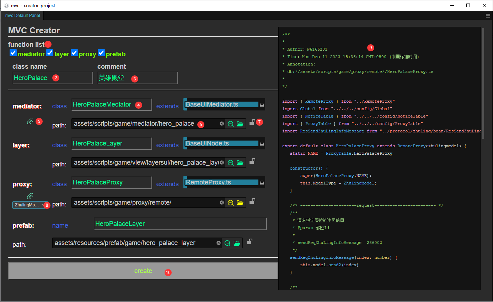
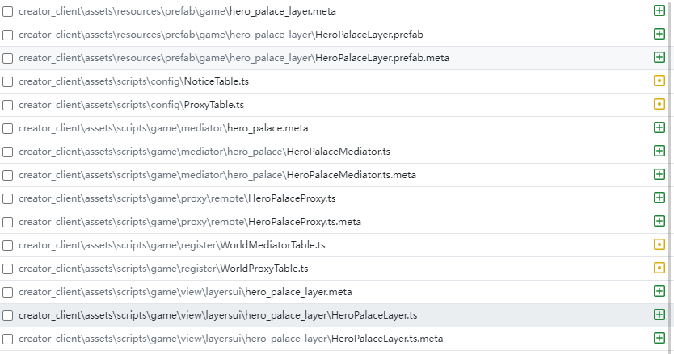

# mvc tool

主面板预览

- **1.功能列表**

    目前可选择layer,mediator,proxy,prefab来自定义导出
- **2.总类名 **

    即将导出的文件列表的所有文件的前缀名，即要做的功能的名字，修改该处的字符串会实时影响到 <a href='#4'>文件名</a> 和 <a href='#6'>文件的导出路径</a>
- **3.注释**

- **4.文件名**

    即将导出的文件的名称，修改该处字符串会实时影响到<a href='#6'>文件的导出路径</a>

- **5.类的链接（默认激活）**

    mvc框架中mediator和layer属于强关联的，链接状态激活的情况下会mediator类默认引用即将导出的layer

    目前的链接有：
  - mediator -> layer
  - proxy -> model

- **6.文件的导出路径（不存在会创建文件夹）**

- **7.路径锁（默认不激活）**

    该锁激活时，修改 <a href='#2'>总类名</a> 和 <a href='#4'>文件名</a> 时，<a href='#2'>文件的导出路径</a> 不会跟着变化

    即一个功能会有多个layer、mediator、proxy的情况下，可以导出在同一个目录下

- **8.类的链接目标类**

    存在该下拉框时，可以选择其中一个符合链接条件的类进行链接

- **9.代码预览**

    点击每一个即将导出的item块（链接状态变化、文件名更新等情况）会刷新右侧代码预览结果

    注：**预览的代码中的大小写等问题可以忽视，一切以实际导出的内容为准**

- **10.导出**

    输出以上所有的文件到对应的路径下，对于已经存在的文件名、路径名，会有对应的红色（黄色）提示

------

**自动注入代码部分**

- 导出的layer文件，会插入layerTable.ts (_layerid需要自己写_)
- 导出的mediator文件，会插入worldMediatorTable.ts
- 导出的proxy文件，会插入worldProxyTable.ts

- mediator链接layer，会创建消息layer_xxx_open和layer_xxx_close，并插入到noticeTable.ts
- proxy链接model，会将该model中所有的reqest和response消息创建对应的响应方法到proxy中，并尽可能做类型推导，将引用外部的bean，import到proxy中

------

**最终效果：**

一键生成+修改十几个文件

------

注：

**所有导出的文件路径和文件名建议谨慎选择和检查，导出的文件内容也并不是所有的可以直接运行的，自行检查修正内部报错**
