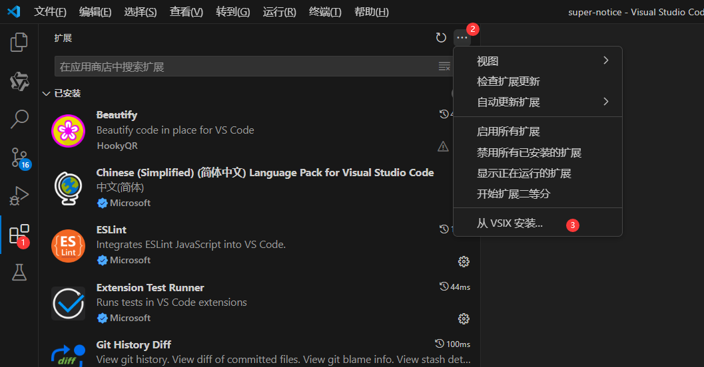
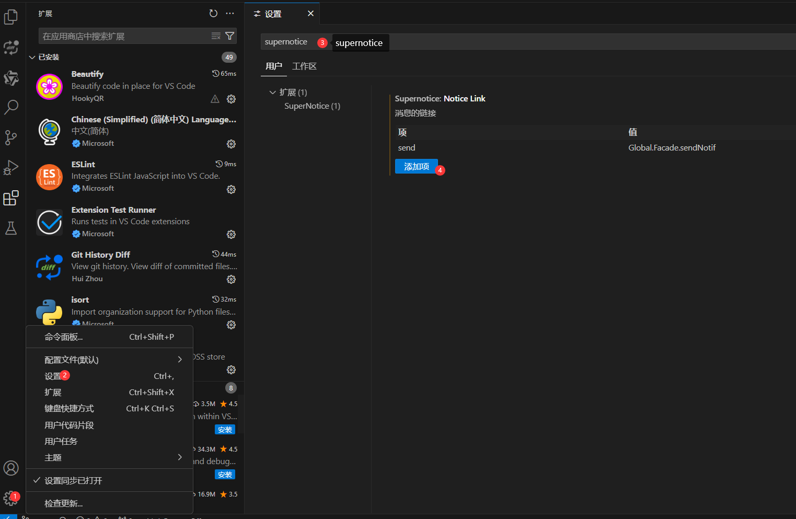
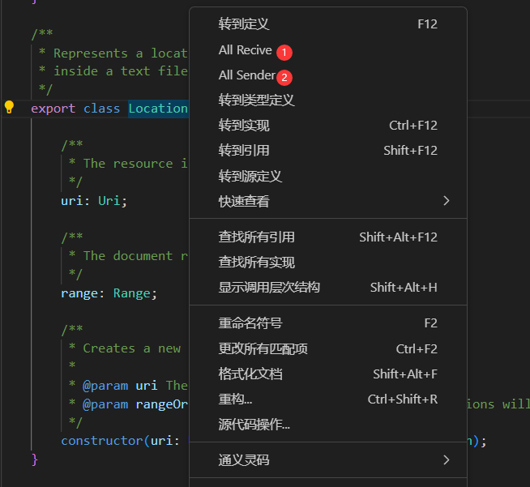
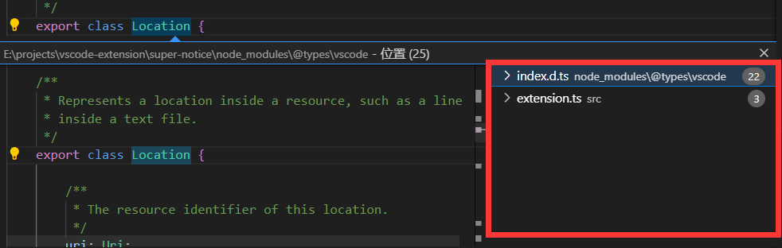

# super-notice README

自定义消息类的快速跳转

- send、recive的消息的设置
- send、recive的消息跳转

# 使用说明

1. 通过vscode的扩展的VSIX安装

2. 打开设置-找到扩展的设置-添加自定义设置

自定义设置中添加项有2种：

- send: 消息的发送者，即要设置发送消息时的字符串
    - 支持  XXX.Send|XXX.SendAsync|XXX.sendNotice ,可以通过竖线来支持多种发送

- recive: 消息的接收者，即要设置接收消息时的字符串
    - 支持  XXX.register|XXX.RegisterAsync|XXX.RendNotice ,可以通过竖线来支持多种接收
    - 可以不填，默认会通过send的结果进行取反

3. 使用

右键指定的属性，在菜单列表中可选【All Recive】 或 【All Sender】 来该属性的所有接收者 和 发送者

4. 结果

查找到的结果是经过过滤的，有可能不是所需要的，可能需要确认自己需要过设置里过滤的字符串

也可能为空，即点击没反应

